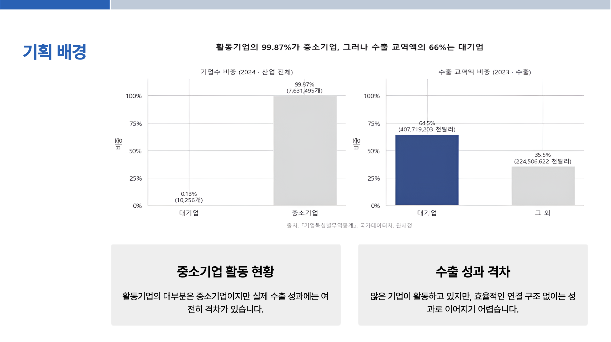
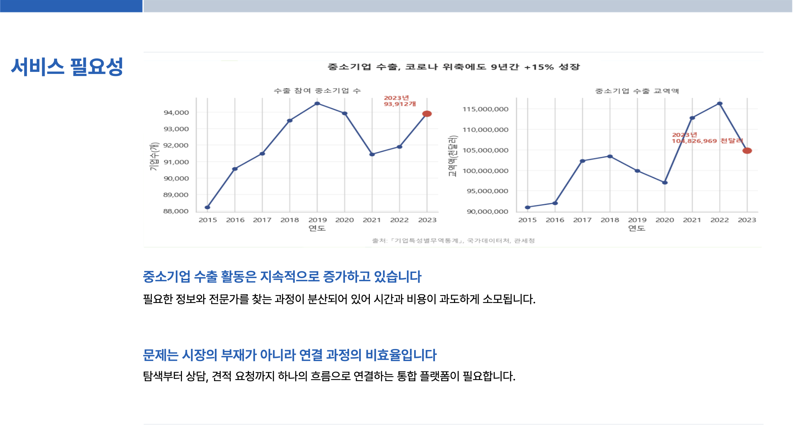
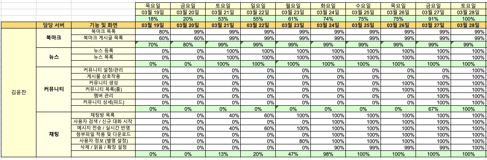

# GlobalGates

> 피드로 여는 기업용 비즈니스 소셜 마켓 — 중소기업의 글로벌 판로 개척 플랫폼

탐색부터 상담·견적까지 하나의 흐름으로 연결하는, 무역 중심의 커뮤니티형 B2B 플랫폼입니다.

 

## 기획 의도

  
  

### 기획 배경

활동 기업의 **99.87%가 중소기업**이지만, 수출 교역액의 **66%는 대기업**이 차지합니다. 수출에 참여하는 중소기업은 코로나 위축 속에서도 9년간 꾸준히 성장했지만, 필요한 정보와 전문가를 찾는 과정이 분산되어 시간과 비용이 과도하게 소모됩니다.

문제는 시장의 부재가 아니라 **연결 과정의 비효율**입니다. GlobalGates는 중소기업도 수출을 통한 이익을 실현할 수 있도록, 탐색·상담·견적을 하나의 흐름으로 잇는 커뮤니티형 플랫폼을 지향합니다.

> 출처: [KOSIS 국가통계포털](https://kosis.kr/index/index.do) — 「기업특성별 무역통계」, 관세청

 

## 기술 스택

| 구분 | 기술 / 도구 |
| --- | --- |
| **HTML Engine** | Thymeleaf |
| **Frontend** | HTML, JavaScript, CSS |
| **Backend** | Spring Boot, Java 17 |
| **Database** | PostgreSQL, Redis |
| **Infra** | AWS EC2, AWS IAM, AWS S3, Docker |
| **API / Library** | OAuth 2.0 (Kakao · Google · Facebook · Naver Login), Kakao Map · 주소, Spring Security, JWT, MyBatis, Lombok, Bootpay, SolAPI, SMTP(Gmail), Swagger UI, FastAPI |
| **Tool** | IntelliJ IDEA, VS Code, PyCharm, Jupyter Notebook |
| **Collaboration** | Git, GitHub, Sourcetree, Slack |
| **Test** | JUnit 5 |

 

## ERD

  

 

## 담당 업무 — 김윤찬 (Backend)

  

| 도메인 | 기능 |
| --- | --- |
| **북마크** | 북마크 목록, 북마크 게시글 목록 |
| **뉴스** | 뉴스 등록, 뉴스 목록 |
| **커뮤니티** | 커뮤니티 생성·설정/관리, 목록(홈), 상세(피드), 게시물 상호작용, 멤버 관리 |
| **채팅** | 채팅방 목록, 사용자 검색 / 신규 대화 시작, 메시지 전송 / 실시간 반영, 첨부파일 업로드·다운로드, 사용자 정보(별명) 설정, 삭제 / 읽음 / 확장 설정 |

 

## 트러블슈팅

### 다중 인스턴스 환경에서 실시간 채팅 메시지 누락

- **문제** — 인스턴스를 늘리자 한 채팅방의 메시지가 일부 사용자에게만 도착하고, UI에서 번갈아 누락되는 현상이 발생했다.
- **원인** — 모든 인스턴스가 동일한 durable 큐(`chat.queue`)를 공유해, RabbitMQ가 라운드로빈으로 메시지를 한 인스턴스에만 전달했다. 다른 인스턴스에 연결된 클라이언트는 메시지를 받지 못했다.
- **해결** — 인스턴스마다 고유한 `AnonymousQueue`(비지속)를 `chat.exchange`에 바인딩하는 **fan-out 구조**로 변경했다. RabbitMQ가 모든 큐에 메시지를 복사 전달하고, 각 인스턴스가 자신의 `SimpleBroker`로 STOMP 브로드캐스트하므로 어느 인스턴스에 연결된 클라이언트든 메시지를 수신한다.

### macOS ↔ Linux 대소문자 차이로 배포 컨테이너에서 500 오류

- **문제** — 로컬(macOS)에서는 정상인 페이지가 배포 컨테이너에서 500 오류를 냈다.
- **원인** — `git core.ignorecase=true` 때문에 대문자 폴더(`Friends`, `Notification` 등)를 소문자로 변경한 내역이 git에 추적되지 않았다. case-sensitive 한 Linux 파일시스템에서 컨트롤러가 경로를 찾지 못했다.
- **해결** — `core.ignorecase=false`로 전환한 뒤, 대문자 인덱스 파일 29개를 `rm --cached`하고 소문자 경로로 재등록했다.

 

## QA 테스트

JUnit 5 · Mockito · AssertJ 기반으로 도메인별 테스트를 작성하고, 단체 QA 단계에서 서로의 작업을 교차 검증했다.

- **단위 · 권한 테스트** — 채팅방·메시지 리액션의 권한 검증(`ChatRoomServiceAuthorizationTest` 등)으로 비인가 사용자의 동작을 차단하고, 게시글·북마크·뉴스 등 서비스 로직을 단위 테스트로 보호했다.
- **매퍼 테스트** — MyBatis 매퍼별 쿼리를 실제 DB에 대해 검증(Post, Bookmark, News, PostProduct 등).
- **정적 회귀 테스트**(`StaticQaRegressionTest`) — 신고 등 프론트엔드 ↔ 백엔드 계약(요청 DTO 형태·에러 처리)을 정적 검사로 고정해 회귀를 방지했다.
- **통합 테스트 분리** — `@SpringBootTest`는 실 DB·Redis·RabbitMQ가 필요해 Docker 빌드 네트워크에서 실행할 수 없어, 배포 빌드에서는 비활성화하고 실 인프라가 갖춰진 로컬·CI 환경에서 실행한다.

 

## 총평

**기획** — 무역이라는 키워드로 커뮤니티형 플랫폼을 만든다는 점에서 참고할 레퍼런스를 찾기 어려웠다. 그러나 반도국가에서 무역을 통한 수익화는 중소기업에게도 필수불가결한 요소라고 판단했고, 실제 상용 서비스로 이어질 수 있도록 기획하다 보니 의도를 탄탄하게 녹여낼 수 있었다.

**협업** — Spring Boot는 1차 프로젝트 경험이 있어 수월할 것이라 예상했지만, Spring Security와 JWT 적용 과정이 복잡해 팀원들과 함께 스터디하며 적용했다. 부팀장으로서 팀장 부재 시 GitHub 관리를 도맡았고, 단체 QA 단계에서 서로의 작업을 보완하는 데 힘썼다.

**좋았던 점** — 이전 프로젝트가 웹 구현 자체에 집중했다면, 이번에는 AI 콘텐츠를 직접 결합해 한층 완성도 높은 사이트를 구현했다. 직접 배포하는 과정이 흥미로웠고, 그 과정에서 Docker를 활용해 본 것도 기술적으로 큰 수확이었다.

**아쉬웠던 점** — 짧은 기간이지만 더 완성도 높은 결과물을 위해 개인 작업에 많은 시간을 투자했다. 그러다 보니 진도를 따라오지 못한 팀원을 도울 여력이 부족했고, 부팀장으로서 리더십을 충분히 발휘하지 못한 점이 아쉽다. 앞으로는 책임감을 갖고 소통으로 풀어가야 할 부분이다.
