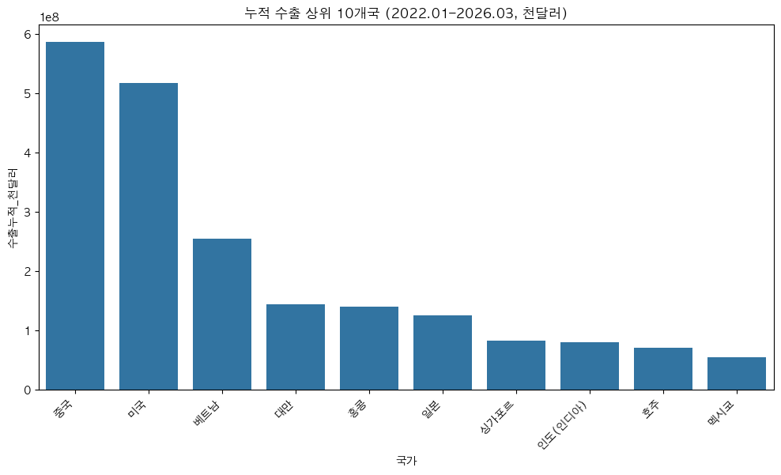
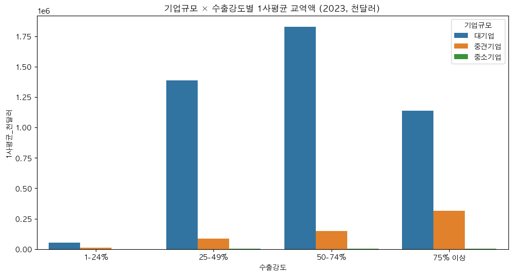
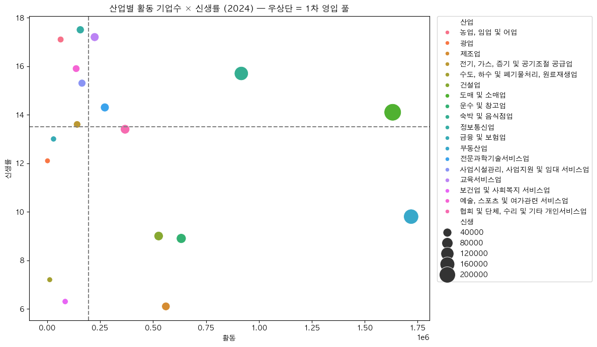
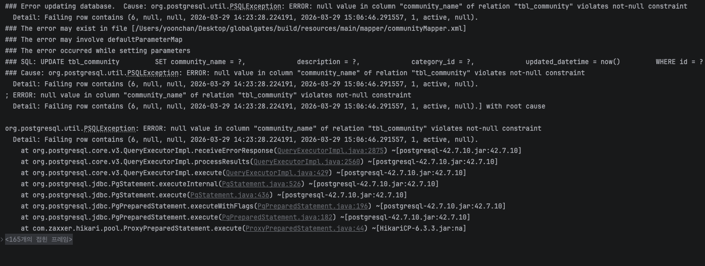
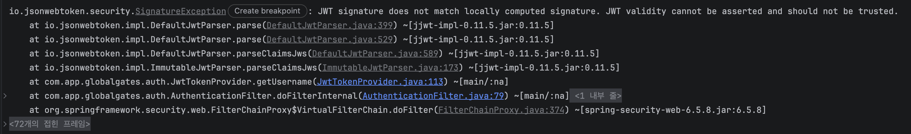
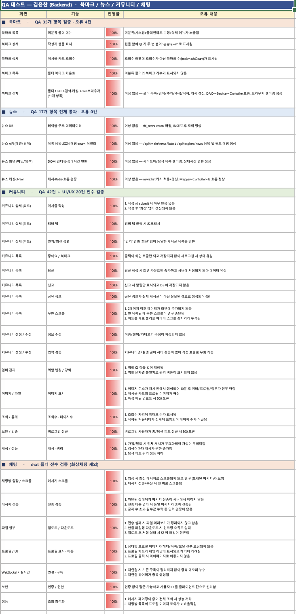

# GlobalGates

> 피드로 여는 기업용 비즈니스 소셜 마켓 — 중소기업의 글로벌 판로 개척 플랫폼

탐색부터 상담·견적까지 하나의 흐름으로 연결하는, 무역 중심의 커뮤니티형 B2B 플랫폼입니다.

<br/>

## 기획 의도

> **"피드로 여는 기업용 비즈니스 소셜 마켓"**
> 한국 수출 구조의 **다대다 미스매치**(많은 중소기업과 많은 신흥 시장이 서로 만나지 못하는 어긋남)를 해소하는 B2B 글로벌 판로 플랫폼

한국 경제는 GDP의 약 **40%를 수출에 의존**합니다. 그러나 그 수출 구조 안에는 두 겹의 양극화가 존재합니다.

### 기획 배경 — 두 겹의 양극화

<p align="center">
  
</p>

**① 기업 규모의 양극화** — 전체 기업의 **99.87%가 중소기업**이지만, 수출 교역액의 **66%(64.5%)는 대기업**이 차지합니다.

- 1사평균(회사 하나당 평균) 교역액 격차: **약 351배**
- 중소기업의 **60.2%가 수출강도**(매출 대비 수출 비중) **1–24% 구간에 9년째 정체**

<p align="center">
  
</p>

**② 시장 분포의 편중** — 수출 참여 중소기업은 코로나 위축에도 **9년간 +15% 성장**(2023년 93,912개사)했지만, 판로는 소수 국가에 쏠려 있습니다.

- 상위 10개국이 전체 수출의 **71.1%**, 중국·미국 두 나라만 **36.2%** → 외생 충격에 취약
- 실제 수출국은 **245개**, 연 1억 달러 이상 시장만 **112개** — 그러나 **신흥 시장 102개의 기회 공간은 사실상 비어 있습니다**

### 본질 문제 — 다대다 미스매치

> 가장 많은 수의 중소기업(**93,912개**)이, 가장 많은 수의 신흥 시장(**102개**)에 도달하지 못하는 다대다 미스매치(many-to-many mismatch)

이는 생산 역량의 문제가 아니라, **바이어를 만날 채널·시장 정보·신뢰 검증이라는 매개 인프라**(중간에서 연결해 주는 다리 역할의 기반)**의 부재**입니다. KOTRA·해외전시회·무역사절단 같은 기존 채널은 1회성·고비용 모델이라 다대다 매칭을 감당하지 못합니다.

### 솔루션 — 3-Layer 플랫폼

| 레이어 | 역할 |
| --- | --- |
| **피드 레이어** | 동종 산업의 수출 성공 사례·시장 시그널을 일상적으로 노출 → 글로벌 감각 형성 |
| **소셜 그래프 레이어** | 산업·타깃 시장 단위로 바이어와 셀러를 다대다 연결 |
| **마켓 레이어** | 카탈로그·계약·결제를 통합한 신뢰 인프라로 1회성 거래 장벽 제거 |

GlobalGates는 단순 가입자 수가 아니라, 중소기업의 **수출강도가 1–24% → 25–49% 구간으로 우상향한 비율**과 **도달 시장이 102개 신흥국으로 확장된 정도**를 성공 척도로 삼습니다.

### 데이터로 검증한 양극화 (KOSIS)

위 양극화를 KOSIS 무역통계로 정량 검증했습니다.

**시장 편중** — 누적 수출이 중국·미국에 압도적으로 집중되고, 그 밖 신흥 시장의 기회 공간이 비어 있음이 드러납니다.

<p align="center">
  
</p>

**기업 규모 격차** — 1사평균 교역액은 모든 수출강도 구간에서 대기업이 압도하며, 중소기업(녹색)은 사실상 바닥에 깔려 있습니다.

<p align="center">
  
</p>

**1차 영입 풀** — 활동 기업수(가로)와 신생률(세로)이 동시에 높은 우상단 산업이, 플랫폼이 가장 먼저 끌어들여야 할 셀입니다.

<p align="center">
  
</p>

> 출처: [KOSIS 국가통계포털](https://kosis.kr/index/index.do) — 「기업특성별 무역통계」, 국가데이터, 관세청

<br/>

## 기술 스택

| 구분 | 기술 / 도구 |
| --- | --- |
| **HTML Engine** | Thymeleaf |
| **Frontend** | HTML, JavaScript, CSS |
| **Backend** | Spring Boot, Java 17 |
| **Database** | PostgreSQL, Redis |
| **Infra** | AWS EC2, AWS IAM, AWS S3, Docker |
| **API / Library** | OAuth 2.0 (Kakao · Google · Facebook · Naver Login), Kakao Map · 주소, Spring Security, JWT, MyBatis, Lombok, Bootpay, SolAPI, SMTP(Gmail), Swagger UI, FastAPI |
| **Tool** | IntelliJ IDEA, VS Code, PyCharm, Jupyter Notebook |
| **Collaboration** | Git, GitHub, Sourcetree, Slack |
| **Test** | JUnit 5 |

<br/>

## ERD

<p align="center">
  
</p>

<br/>

## 담당 업무 — 김윤찬 (Backend)

<p align="center">
  
</p>

- **북마크**
  - 북마크 목록
  - 북마크 게시글 목록
- **뉴스**
  - 뉴스 등록
  - 뉴스 목록
- **커뮤니티**
  - 커뮤니티 생성
  - 커뮤니티 설정 / 관리
  - 커뮤니티 목록(홈)
  - 커뮤니티 상세(피드)
  - 게시물 상호작용
  - 멤버 관리
- **채팅**
  - 채팅방 목록
  - 사용자 검색 / 신규 대화 시작
  - 메시지 전송 / 실시간 반영
  - 첨부파일 업로드 · 다운로드
  - 사용자 정보(별명) 설정
  - 삭제 / 읽음 / 확장 설정

<br/>

## 트러블슈팅

### 다중 인스턴스 환경에서 실시간 채팅 메시지 누락

- **문제** — 인스턴스를 늘리자 한 채팅방의 메시지가 일부 사용자에게만 도착하고, UI에서 번갈아 누락되는 현상이 발생했다.
- **원인** — 모든 인스턴스가 동일한 durable 큐(`chat.queue`)를 공유해, RabbitMQ가 라운드로빈으로 메시지를 한 인스턴스에만 전달했다. 다른 인스턴스에 연결된 클라이언트는 메시지를 받지 못했다.
- **해결** — 인스턴스마다 고유한 `AnonymousQueue`(비지속)를 `chat.exchange`에 바인딩하는 **fan-out 구조**로 변경했다. RabbitMQ가 모든 큐에 메시지를 복사 전달하고, 각 인스턴스가 자신의 `SimpleBroker`로 STOMP 브로드캐스트하므로 어느 인스턴스에 연결된 클라이언트든 메시지를 수신한다.

### macOS ↔ Linux 대소문자 차이로 배포 컨테이너에서 500 오류

- **문제** — 로컬(macOS)에서는 정상인 페이지가 배포 컨테이너에서 500 오류를 냈다.
- **원인** — `git core.ignorecase=true` 때문에 대문자 폴더(`Friends`, `Notification` 등)를 소문자로 변경한 내역이 git에 추적되지 않았다. case-sensitive 한 Linux 파일시스템에서 컨트롤러가 경로를 찾지 못했다.
- **해결** — `core.ignorecase=false`로 전환한 뒤, 대문자 인덱스 파일 29개를 `rm --cached`하고 소문자 경로로 재등록했다.

### 커뮤니티 수정 시 `community_name` NOT NULL 제약 위반

<p align="center">
  
</p>

**💥 문제 상황** — 커뮤니티 설정에서 커버 이미지만 교체하는 요청에도 `UPDATE tbl_community SET community_name = NULL ...`이 실행되며, `null value in column "community_name" violates not-null constraint` 오류로 500이 발생했다.

**🔍 문제 원인** — `update` 매퍼가 정적 SQL이라 호출될 때마다 `community_name`을 항상 덮어쓴다. 이름을 바꾸지 않는 요청에서는 이 값이 `null`로 전달되는데, 컬럼은 NOT NULL이라 제약을 위반했다.

**🛠️ 해결 방안** — 서비스 계층에서 이름이 실제로 전달된 경우에만 UPDATE를 실행하도록 가드를 두고, 커버 이미지 교체 등 다른 변경은 별도 분기로 분리했다.

```java
// CommunityService.updateCommunity()
// 이름이 전달된 경우에만 UPDATE → 커버만 교체하는 요청의 NULL 덮어쓰기 차단
if (vo.getCommunityName() != null) {
    communityDAO.update(CommunityVO.builder()
            .id(communityId)
            .communityName(vo.getCommunityName())
            .description(vo.getDescription())
            .categoryId(vo.getCategoryId())
            .build());
}
```

### 잘못된 서명의 JWT로 인증 필터가 500 오류

<p align="center">
  
</p>

**💥 문제 상황** — 서명이 일치하지 않는 토큰이 들어오면 `JWT signature does not match locally computed signature`(`SignatureException`)가 인증 필터에서 처리되지 못하고, 요청 전체가 500으로 실패했다.

**🔍 문제 원인** — 토큰을 파싱(`parseClaimsJws`)하기 전에 서명 유효성을 먼저 확인하지 않아, 위조·만료 토큰이 곧바로 파싱 단계로 진입하면서 예외가 호출 스택을 타고 그대로 전파됐다.

**🛠️ 해결 방안** — 예외를 잡아 `false`를 돌려주는 `validateToken()`으로 서명을 먼저 검증하고, 통과한 토큰만 `getAuthentication()`으로 넘기도록 순서를 정리했다. 서명이 어긋난 요청은 예외 대신 비인증 상태로 흘려보내 500 대신 정상적인 인증 실패로 처리된다.

```java
public boolean validateToken(String token) {
    try {
        Jwts.parserBuilder().setSigningKey(key).build().parseClaimsJws(token);
        return true;
    } catch (Exception e) {   // SignatureException 등 → 위조·만료 토큰
        return false;
    }
}

// AuthenticationFilter — 검증을 통과한 토큰만 파싱·인증
if (jwtTokenProvider.validateToken(accessToken)) {
    Authentication auth = jwtTokenProvider.getAuthentication(accessToken);
    SecurityContextHolder.getContext().setAuthentication(auth);
}
```

<br/>

## QA 테스트

북마크 · 뉴스 · 커뮤니티 · 채팅 도메인을 직접 검증하고, 발견한 오류를 화면·기능별로 정리했다.

<p align="center">
  
</p>

검증은 JUnit 5 · Mockito · AssertJ 단위/권한 테스트와 정적 회귀 테스트로 보완했으며, 실 DB · Redis · RabbitMQ가 필요한 통합 테스트(`@SpringBootTest`)는 배포 빌드와 분리해 로컬 · CI에서 실행한다.

<br/>

## 총평

### 1. 기획 및 요구사항 정의 — 비즈니스 로직에 대한 깊은 고민과 갈등 해결

'무역'이라는 특수하고 전문적인 도메인을 다루는 커뮤니티형 플랫폼을 기획하는 것은 참고할 만한 레퍼런스가 부족하여 초기 방향성을 수립하는 데 큰 도전이었다. 하지만 반도국가인 우리나라의 특성상 무역을 통한 수익화는 중소기업에게 필수불가결한 요소라고 판단했다. 이에 따라 단순한 게시판 형태를 넘어, 실제 B2B 실무자들이 유의미한 정보를 교류하고 상용화 수준으로 이용할 수 있는 플랫폼을 목표로 기획의 뼈대를 세웠다.

매일 진행된 기획 회의에서는 각자가 생각하는 서비스의 방향성이 달라 잦은 의견 충돌이 발생했다. 부팀장으로서 이러한 소통의 병목을 해결하는 것이 프로젝트 성공의 첫걸음이라 생각했고, 회의 중 나오는 추상적인 아이디어와 상충하는 의견들을 메모장에 실시간으로 문서화하며 회원 권한 관리, 게시글 카테고리 분류, 무역 정보 제공 등 필수 요구사항(Requirements)을 정리했다.

시각화된 자료를 바탕으로 회의를 진행하자 팀원들도 자신의 의견을 객관적으로 되돌아보게 되었고, 점진적으로 타협점을 찾아 탄탄한 기획안을 완성할 수 있었다. 이렇게 정리한 요구사항은 API 명세와 ERD(데이터베이스 설계) 등 구체적인 백엔드 설계로 연결지었다. 출석하지 못하거나 조퇴하는 팀원이 생기면 이 문서를 공유해 프로젝트의 연속성을 잃지 않도록 했고, 갈등이 심화될 때는 문서를 기반으로 각자의 입장을 존중하는 중재자 역할을 수행하며 팀을 하나로 뭉치게 하는 커뮤니케이션 역량을 길렀다.

### 2. 협업과 리더십 — 위기를 기회로 만든 스터디와 코드 품질 관리

팀 프로젝트의 핵심은 '개인의 실력을 모아 시너지를 내는 것'이었다. 팀장의 부재 시에는 내가 GitHub 레포지토리 관리를 전담하며 브랜치 전략을 수립하고, 코드 병합(Merge) 과정의 충돌(Conflict)을 최소화하기 위한 코드 리뷰 분위기를 조성했다. 특히 단체 QA 작업 시 서로가 개발한 API의 응답 값과 예외 처리 방식을 체크하며 시스템의 안정성을 높이는 데 주력했다.

팀원 간 숙련도 차이로 개발 속도에 편차가 생기는 어려움이 있었다. 이를 극복하기 위해 진도가 더딘 팀원들과는 자발적으로 밤 10시까지 남아 함께 디버깅하고 설계 방향성을 잡아주었으며, 귀가 후에도 Discord 화면 공유로 비동기적으로 소통했다. 평소 점심식사를 함께하며 유대감을 형성해 둔 덕분에 누구나 막힘이 있을 때 주저 없이 도움을 요청하는 수평적이고 협력적인 팀 문화가 정착되었다.

이러한 결속력은 프로젝트 중반, 부득이하게 팀원이 이탈하는 위기 상황에서 빛을 발했다. 남은 팀원들이 당황하지 않고 이탈한 팀원의 몫을 재분배해 맡았으며, Google Docs로 각자가 이해한 기술적 내용과 구현 방식을 문서화해 공유했다. 학습 자료가 투명하게 공유되자 팀 전체의 기술적 이해도가 상향 평준화되었고, 결과적으로 다른 팀들보다 빠르고 안정적으로 프로젝트를 완수할 수 있었다.

### 3. 백엔드 기술적 도전 — Spring Security와 JWT 인증/인가 아키텍처

이전 프로젝트에서 Spring Boot의 기본적인 MVC 패턴을 경험해 초기 세팅은 수월했지만, 이번 프로젝트의 가장 큰 기술적 허들은 Spring Security와 JWT(JSON Web Token)를 결합한 인증·인가 시스템의 도입이었다. 무역 플랫폼의 특성상 사용자 권한(일반 유저, 기업 유저, 관리자 등)에 따른 철저한 접근 제어가 필요했다. 세션 기반 인증 대신 서버 상태를 유지하지 않는(Stateless) JWT 방식을 채택하면서 Filter Chain의 동작 원리를 깊이 있게 파악해야 했고, Access Token과 Refresh Token의 생명주기를 설정하고 토큰 만료 시 발생하는 예외를 클라이언트에게 명확한 상태 코드로 전달하는 커스텀 예외 처리 로직을 구현하는 과정이 복잡했다. 팀원들과 Security 구조를 심도 있게 스터디하며 문제를 돌파했고, 결과적으로 확장성 있고 안전한 RESTful API 서버를 구축하는 귀중한 기술적 자산을 얻었다.

### 4. 좋았던 점 — 단순 웹을 넘어선 AI 콘텐츠 연동과 Docker 인프라 배포

가장 큰 성취감을 느낀 부분은 이전처럼 단순한 CRUD 웹 서비스 구현에 그치지 않고, AI 기반 콘텐츠를 직접 시스템에 심어 더 트렌디하고 고도화된 서비스를 구축했다는 점이다. 외부 AI를 호출하고 응답 데이터를 파싱해 클라이언트 UI에 맞게 가공·전달하는 백엔드의 중계자 역할을 충실히 수행하며 외부 리소스 연동에 대한 자신감을 얻었다.

또한 로컬 개발을 넘어 완성된 애플리케이션을 직접 서버에 배포하는 인프라 구축 과정이 매우 흥미로웠다. 특히 Docker로 애플리케이션과 실행 환경을 컨테이너화한 것은 기술적으로 큰 도약이었다. 환경 변수 설정이나 버전 충돌 문제를 최소화하며 배포 프로세스를 규격화하는 경험을 통해, 단순히 코드를 짜는 개발자를 넘어 서버 운영과 배포 환경까지 종합적으로 고려하는 백엔드 엔지니어로서의 시야를 넓힐 수 있었다.

### 5. 아쉬웠던 점 및 향후 목표 — 코드의 깊이와 성능 최적화에 대한 갈증

짧은 개발 기간 속에서도 더 완벽한 작업물을 위해 많은 시간을 투자하며 코딩에 매진했지만, 돌이켜보면 아쉬운 점도 있다. 기능 구현과 기한 준수에 집중하다 보니 중복 코드를 완벽히 리팩토링하거나 객체지향 설계 원칙(SOLID)을 더 철저히 지키지 못한 부분들이 눈에 밟힌다.

이번 프로젝트의 경험을 바탕으로, 향후에는 대용량 트래픽 상황에서의 쿼리 최적화, Redis를 활용한 캐싱 처리, 그리고 TDD(테스트 주도 개발)를 깊이 있게 학습해 더욱 견고하고 유지보수성 높은 백엔드 아키텍처를 설계하는 개발자로 성장하겠다.
